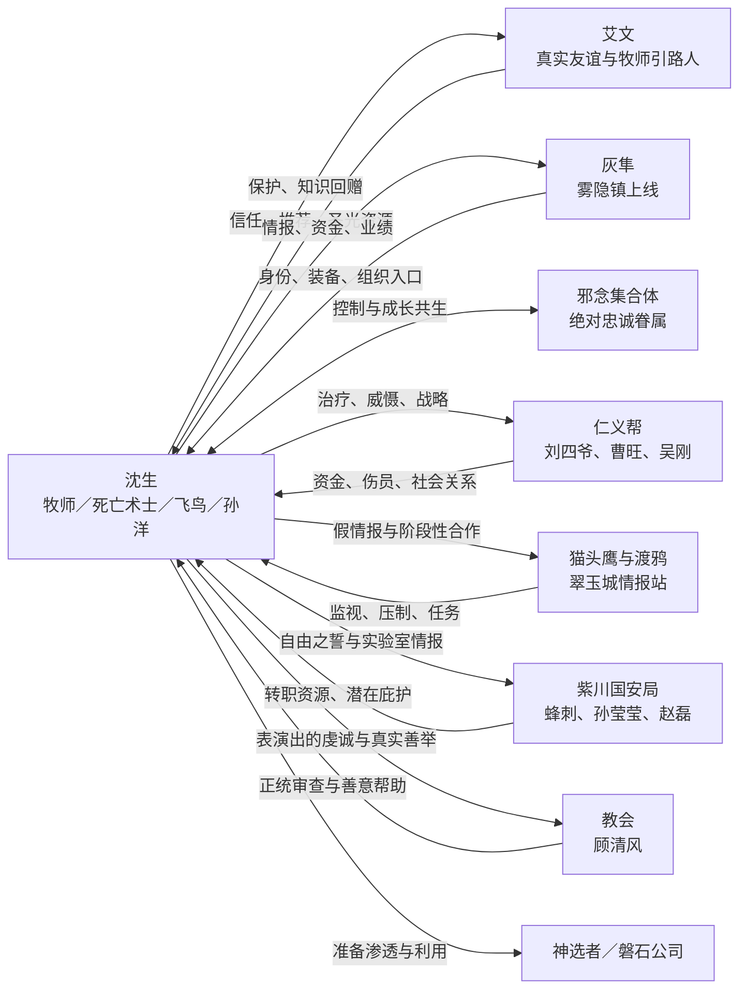

# 人物关系

## 核心关系图

## 关系强度与风险

| 关系 | 信任程度 | 利益绑定 | 暴露风险 | 当前性质 |
|---|---:|---:|---:|---|
| 沈生—艾文 | 高 | 中 | 高 | 真实友谊，艾文可能成为道德与净化锚点 |
| 沈生—灰隼 | 中 | 高 | 中 | 互利、互坑但总体可靠 |
| 沈生—邪念集合体 | 绝对控制 | 极高 | 极高 | 主从共生 |
| 沈生—仁义帮 | 中 | 高 | 中 | 长期合作与声望网络 |
| 沈生—猫头鹰 | 极低 | 中 | 极高 | 表面上下级、实质对手 |
| 沈生—渡鸦 | 低 | 中 | 极高 | 互相忌惮的临时搭档 |
| 沈生—紫川国安局 | 低 | 高 | 极高 | 尚未稳定的情报交易 |
| 沈生—孙莹莹 | 中低 | 中高 | 高 | 合作、试探和误解并存 |
| 沈生—顾清风 | 中 | 低 | 高 | 对方真心帮助，但目标冲突 |

## 沈生的关系策略

- 对善良角色：先利用，后产生真实回馈，例如艾文。
- 对利益角色：明确交换，同时让对方觉得长期合作更划算，例如刘四爷。
- 对强势上级：建立外部筹码，避免单方控制，例如猫头鹰。
- 对敌人：尽量借他人或身份完成清除，减少核心秘密暴露。
- 对潜在队友：危局中观察其选择，再决定是否投入真实信任，例如李现、钱宇、吴刚。
