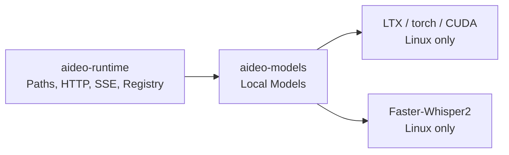

# Technical Plan: feat-aideo-models-extraction

## 目录结构

```text
packages/
├── aideo-models/                                  # [新增] 跨平台本地模型库
│   ├── README.md
│   ├── pyproject.toml                              # Linux CUDA / LTX / Whisper 依赖
│   ├── src/aideo_models/
│   │   ├── __init__.py                             # 公共 API
│   │   ├── ltx2.py                                 # [迁移] LTX2 惰性本地模型实现
│   │   ├── whisper.py                              # [迁移] Faster-Whisper2 惰性本地模型实现
│   │   └── models.py                               # 本地请求与结果数据模型
│   └── tests/
│       ├── test_ltx2.py
│       └── test_whisper.py
└── aideo-runtime/
    ├── pyproject.toml                              # [修改] 只依赖 aideo-models；升级 SSE
    └── src/aideo_runtime/
        ├── config.py                               # [保留] Runtime 全局路径配置
        ├── paths.py                                # [保留] 路径安全与输出 URI
        └── backend/providers/
            ├── ltx2.py                             # [重构] Runtime Backend 薄适配层
            └── faster_whisper2.py                  # [重构] Runtime Backend 薄适配层
```

## 依赖方向



- `aideo-models` 不导入 `aideo-runtime`、FastAPI、SSE 类型或 Runtime 路径配置。
- `aideo-runtime` 使用 `PathSettings` 完成所有路径安全校验；仅将验证后的
  `pathlib.Path`、统一 `BackendRequest` 转换后的纯 Python 请求对象交给
  `aideo-models`，再将结果转换为 Runtime Output 和 SSE Event。
- `aideo-models` 的 GPU 依赖均带 `sys_platform == 'linux'` marker；库本身、路径
  模型与接口在 macOS 可导入和测试。

## 核心数据模型

```python
@dataclass(frozen=True, slots=True)
class VideoGenerationRequest:
    prompt: str
    output_path: Path
    seed: int = 42
    height: int = 512
    width: int = 768
    num_frames: int = 121
    frame_rate: float = 24.0
    enhance_prompt: bool = True


@dataclass(frozen=True, slots=True)
class TranscriptionRequest:
    audio_path: Path
    language: str | None
    beam_size: int = 5
    word_timestamps: bool = True
    vad_filter: bool = False


@dataclass(frozen=True, slots=True)
class TranscriptionResult:
    text: str
    segments: list[dict[str, object]]
    language: str
    language_probability: float
    duration_seconds: float
```

## 接口定义

```python
class LTX2Model:
    def __init__(self, models_dir: Path) -> None: ...
    async def generate(self, request: VideoGenerationRequest) -> Path: ...
    async def aclose(self) -> None: ...


class FasterWhisper2Model:
    def __init__(self, models_dir: Path) -> None: ...
    async def transcribe(self, request: TranscriptionRequest) -> TranscriptionResult: ...
    async def aclose(self) -> None: ...
```

Runtime Provider 保持下列外部契约不变：

- `ltx2`：`input.prompt`、可选 `input.filename` 与现有生成 `parameters`；返回
  `VideoOutput(runtime://output/...)`；发射 `ProgressEvent`、`DoneEvent`。
- `faster_whisper2`：`input.audio_path`、可选 `input.language` 与现有转写
  `parameters`；返回 `TextOutput` 与转写元数据。

## 依赖与版本策略

- 使用 `uv add` 将 LTX、Whisper、torch、torchvision、torchaudio、safetensors、
  NVIDIA CUDA 13 依赖及 PyTorch index/Git sources 从 Runtime 移到 `aideo-models`。
- `aideo-runtime` 移除上述模型/GPU 依赖，改为 workspace 依赖 `aideo-models`。
- 通过 `uv add --package aideo-runtime sse-starlette` 升级到解析时可用的最新稳定版，
  同步 `uv.lock`；HTTP/SSE 契约测试确保升级无 API 回归。

## 实施阶段

### Phase 1 — 新库与跨平台基础

- 目标：创建可独立导入的 `aideo-models`，迁移 Linux-only 依赖；Runtime 路径
  功能与现有测试保持原位。
- 产出文件：新包 `pyproject.toml`、workspace 依赖配置和导入测试。

### Phase 2 — 本地模型迁移

- 目标：将 LTX2 与 Faster-Whisper2 的加载和执行逻辑移入模型库。
- 产出文件：本地请求/结果模型、`ltx2.py`、`whisper.py` 及 mock 单元测试。

### Phase 3 — Runtime 薄适配与 SSE 升级

- 目标：将 Runtime Provider 改为适配层，升级 `sse-starlette` 且保持 API 契约。
- 产出文件：Provider 重构、配置/import 更新、SSE/HTTP 回归测试。

### Phase 4 — 文档与验证

- 目标：完成跨平台使用文档、变更记录和全套质量验证。
- 产出文件：两个 README、`.env.example`、changes、`uv.lock`、pre-commit 结果。
