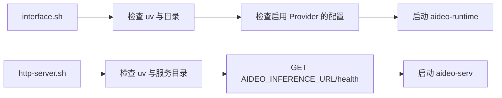

# Technical Plan: feat-startup-script-hardening

## 目录结构

```text
aideo/
├── interface.sh                                  # [修改] Runtime Linux 启动与本地模型预检
├── http-server.sh                                # [修改] aideo-serv 启动与 Runtime 健康检查
├── tests/
│   ├── test_interface_script.sh                  # [新增] Runtime 脚本的 shell 集成测试
│   └── test_http_server_script.sh                # [新增] 服务端脚本的 shell 集成测试
└── specs/feat-startup-script-hardening/
    ├── spec.md
    ├── plan.md
    └── tasks.md
```

## 启动流程



## 核心约定

### 通用 shell 行为

- 使用 `set -euo pipefail`、`command -v uv`、`mkdir -p` 和清晰的
  `error/info/success` 日志函数。
- 所有变量均以现有 `AIDEO_*`、`WHISPER_*`、`LTX2_*` 名称传递；不改变默认端口。
- 日志只能显示 API Key 是否设置，绝不能输出其值。
- 使用 `exec env ... uv run ...` 保持子进程信号传播。

### `interface.sh`

- 默认绑定继续为 `0.0.0.0:9090`，适用于 Linux 局域网部署。
- 创建 `AIDEO_RUNTIME_MODELS_DIR`、`AIDEO_RUNTIME_INPUT_DIR` 和
  `AIDEO_RUNTIME_OUTPUT_DIR`。
- 日志显示 `AIDEO_RUNTIME_DEBUG` 状态，并转发给 Runtime。
- 当 `AIDEO_RUNTIME_PROVIDERS` 包含 `ltx2` 时，校验 checkpoint、Gemma 根目录和
  upsampler 均为 models root 下存在的路径；未启用 LTX 不做这些检查。
- 当 Provider 列表包含 `faster_whisper2` 时，只显示 Whisper 模型/设备配置，允许
  模型通过 `download_root` 在首次调用时下载。

### `http-server.sh`

- 创建 `AIDEO_STORAGE_BASE_DIR`、`AIDEO_ASSET_BASE_DIR`、`AIDEO_INPUT_ROOT` 和
  `AIDEO_OUTPUT_ROOT`。
- 使用 `curl -fsS --connect-timeout 2 --max-time 5` 对
  `${AIDEO_INFERENCE_URL%/}/health` 预检；失败时说明应先启动 Runtime 或修正 URL。
- 健康检查成功后显示 Runtime 返回内容，再启动 aideo-serv。
- 保持 `AIDEO_MODEL_ROOT` 的既有配置，明确它应与 Runtime models root 指向同一
  Linux 挂载卷或相同目录树。

## 测试接口

Shell 测试使用临时目录与 fake `uv`/`curl` 放在 `PATH` 前端：

```bash
PATH="$fake_bin:$PATH" AIDEO_RUNTIME_PROVIDERS=demo ./interface.sh
PATH="$fake_bin:$PATH" AIDEO_INFERENCE_URL=http://runtime:9090 ./http-server.sh
```

断言目录创建、环境变量转发、预检失败退出码、健康 URL 以及敏感 API Key 脱敏。

## 实施阶段

### Phase 1 — Runtime 脚本

- 目标：实现 `interface.sh` 的通用预检、目录准备、debug 转发和 LTX 条件校验。
- 产出：Runtime 脚本测试与实现。

### Phase 2 — 服务端脚本

- 目标：实现 `http-server.sh` 的通用预检、目录准备和 Runtime 健康检查。
- 产出：服务端脚本测试与实现。

### Phase 3 — 文档与验证

- 目标：说明 Linux 使用方式并完成 shell 语法与测试验证。
- 产出：README、变更记录、`bash -n` 与 shell 测试结果。
